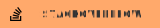

    <h1 align="center"> Hi there 👋 </h1>
    

    
    
    
     
    
    

    <h2 align="center"> ✍️ About me </h2>
    
 Hi ! I'm Ladislas WALCAK, or simply Ladislus, a 22 years old computer science student from 🥐🇫🇷🥖 

    
 Right now, my Github account hosts almost exclusively the projects I had to do during my master's degree, along with a bunch of small personnal projects. Most of these repositories are private, which means that if you can see it, that means I'm proud of it (or at least I'm not ashamed enough to hide it). 

    
 I'm currently trying to learn Rust, along with game developpement using Unreal Engine and a bit of Blender. 

<h2 align="center"> 🛠️ A bunch of technologies I'm familliar with </h2>
<table align="center">
    <tr>
        <td>
            

                <h3> Programming languages </h3>
                
                
                
                
                
                
            

        </td>
        <td>
            

                <h3> Web </h3>
                
                
                
                
            

        </td>
    </tr>
    <tr>
        <td>
            

                <h3> Database </h3>
                
                
                
            

        </td>
        <td>
            

                <h3> Big Data </h3>            
                
                
            

        </td>
    </tr>
    <tr>
        <td>  
            

                <h3> Mobile </h3>
                
                
                
            

        </td>
        <td>
            

                <h3> Tools </h3>
                
                
                
                
            

        </td>
    </tr>
</table>
<h2 align="center"> 🔥 My stats </h2>

    
    

    <h2> 📖 Some public repositories that represent me best </h2>
    
    
    
    
    
    
    
    
    
    

